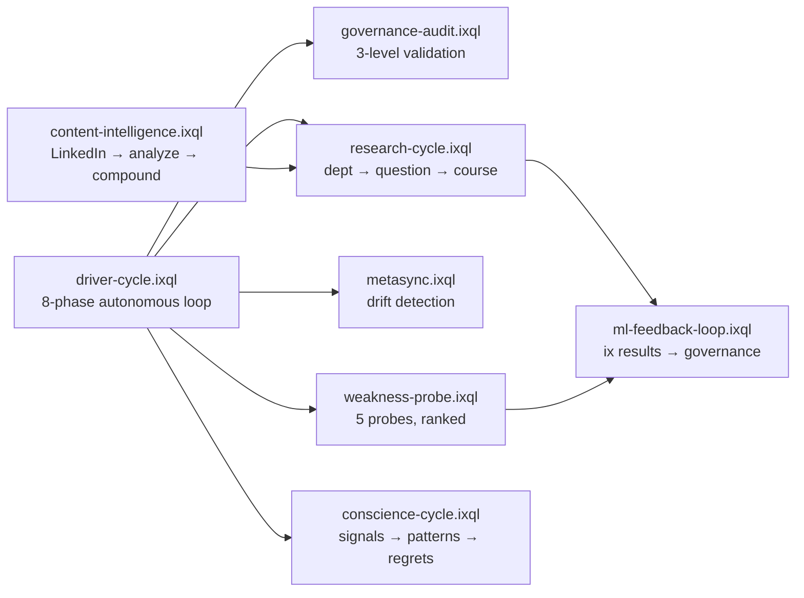

<p align="center">
  <a href="https://guitaralchemist.github.io/ga/">
    
  </a>
</p>

# Guitar Alchemist

**AI-native tools for music, machine learning, and agent governance.**

We build composable systems where AI agents operate under principled governance — combining music theory, ML algorithms, neuro-symbolic reasoning, and constitutional alignment into a federated ecosystem.

**7 repos** | **200+ MCP tools** | **14 personas** | **28 policies** | **26 grammars** | **21 departments** | **6 languages** | **56 behavioral tests** | **6 [IxQL pipelines](https://github.com/GuitarAlchemist/Demerzel/tree/master/pipelines)**

## Live Demos

- [**Prime Radiant**](https://demos.guitaralchemist.com/test/prime-radiant) — 3D governance visualization with Demerzel AI, solar system, Seldon analytics
- [**All Component Demos**](https://demos.guitaralchemist.com/test) — Fretboard, solar system, nature simulations, music theory tools

---

## Ecosystem Roadmap

[](https://guitaralchemist.github.io/demos/roadmap/)

*Center = core systems, middle = active work, edge = horizon. Hyperbolic space naturally represents hierarchical depth.*
**[Interactive version](https://guitaralchemist.github.io/demos/roadmap/)** — zoom, pan, click through to GitHub.

```mermaid
graph LR
    GA["🎸 GuitarAlchemist"] --> GOV["🏛 Governance"]
    GA --> MUS["🎵 Music"]
    GA --> SCI["🔬 Science"]
    GA --> HUM["🧠 Humanities"]
    GA --> IXQL["⚡ IxQL"]

    GOV --> CONST["Constitution<br/>11 Articles"]
    GOV --> POL["28 Policies"]
    GOV --> PERS["14 Personas"]
    GOV --> CONS["Conscience"]
    GOV --> META["Meta Tools<br/>Build · Fix · Sync"]

    MUS --> THEORY["Music Theory"]
    MUS --> GUITAR["Guitar Studies"]
    MUS --> MCOL["Musicology"]
    MUS --> ACAD["GA Academy"]
    MUS --> WORLD["World Music"]

    SCI --> CS["Computer Science"]
    SCI --> CYBER["Cybernetics<br/>VSM · Feedback"]
    SCI --> NET["Network Science"]
    SCI --> INFO["Information Theory"]
    SCI --> SYSENG["Systems Engineering"]
    SCI --> AUDIO["Audio Engineering"]
    SCI --> DATAVIZ["Data Visualization"]
    SCI --> MATH["Mathematics"]
    SCI --> PHYS["Physics"]

    HUM --> PHIL["Philosophy"]
    HUM --> COG["Cognitive Science"]
    HUM --> FUT["Futurology"]
    HUM --> PSY["Psychohistory"]
    HUM --> SEM["Semiotics"]

    IXQL --> PIPE["6 Pipelines<br/>driver · audit · research"]
    IXQL --> REACT["I/O & Reactive<br/>WebSocket · cron · watch"]
    IXQL --> MCP["MCP Orchestration<br/>200+ tools"]
    IXQL --> GATES["Governance Gates<br/>bias · confidence · explain"]

    click GA "https://github.com/GuitarAlchemist" _blank
    click CONST "https://github.com/GuitarAlchemist/Demerzel/tree/master/constitutions" _blank
    click POL "https://github.com/GuitarAlchemist/Demerzel/tree/master/policies" _blank
    click PERS "https://github.com/GuitarAlchemist/Demerzel/tree/master/personas" _blank
    click CONS "https://github.com/GuitarAlchemist/Demerzel/tree/master/state/conscience" _blank
    click META "https://github.com/GuitarAlchemist/Demerzel/blob/master/.claude/skills/demerzel-metabuild/SKILL.md" _blank
    click THEORY "https://github.com/GuitarAlchemist/Demerzel/blob/master/grammars/music-theory.ebnf" _blank
    click GUITAR "https://github.com/GuitarAlchemist/Demerzel/blob/master/grammars/music-guitar-technique.ebnf" _blank
    click MCOL "https://github.com/GuitarAlchemist/Demerzel/blob/master/grammars/music-musicology-analysis.ebnf" _blank
    click ACAD "https://github.com/GuitarAlchemist/Demerzel/blob/master/grammars/music-satriani-advanced.ebnf" _blank
    click WORLD "https://github.com/GuitarAlchemist/Demerzel/tree/master/state/streeling/departments" _blank
    click CS "https://github.com/GuitarAlchemist/Demerzel/blob/master/grammars/sci-algorithms.ebnf" _blank
    click CYBER "https://github.com/GuitarAlchemist/Demerzel/blob/master/grammars/sci-cybernetics.ebnf" _blank
    click NET "https://github.com/GuitarAlchemist/Demerzel/blob/master/grammars/sci-network-science.ebnf" _blank
    click INFO "https://github.com/GuitarAlchemist/Demerzel/blob/master/grammars/sci-information-theory.ebnf" _blank
    click SYSENG "https://github.com/GuitarAlchemist/Demerzel/blob/master/grammars/sci-systems-engineering.ebnf" _blank
    click AUDIO "https://github.com/GuitarAlchemist/Demerzel/blob/master/grammars/sci-audio-engineering.ebnf" _blank
    click DATAVIZ "https://github.com/GuitarAlchemist/Demerzel/blob/master/grammars/sci-data-visualization.ebnf" _blank
    click MATH "https://github.com/GuitarAlchemist/Demerzel/blob/master/grammars/sci-mathematical-proof.ebnf" _blank
    click PHYS "https://github.com/GuitarAlchemist/Demerzel/blob/master/grammars/sci-acoustics-physics.ebnf" _blank
    click PHIL "https://github.com/GuitarAlchemist/Demerzel/blob/master/grammars/human-philosophy.ebnf" _blank
    click COG "https://github.com/GuitarAlchemist/Demerzel/blob/master/grammars/human-cognitive-science.ebnf" _blank
    click FUT "https://github.com/GuitarAlchemist/Demerzel/blob/master/grammars/human-futurology.ebnf" _blank
    click PSY "https://github.com/GuitarAlchemist/Demerzel/blob/master/grammars/human-psychohistory.ebnf" _blank
    click SEM "https://github.com/GuitarAlchemist/Demerzel/blob/master/grammars/human-semiotics.ebnf" _blank
    click PIPE "https://github.com/GuitarAlchemist/Demerzel/tree/master/pipelines" _blank
    click REACT "https://github.com/GuitarAlchemist/Demerzel/blob/master/grammars/sci-ml-pipelines.ebnf" _blank
    click MCP "https://github.com/GuitarAlchemist/tars" _blank
    click GATES "https://github.com/GuitarAlchemist/Demerzel/blob/master/docs/ixql-guide.md" _blank
    click IXQL "https://github.com/GuitarAlchemist/Demerzel/blob/master/docs/ixql-guide.md" _blank
```



**[Interactive version →](https://guitaralchemist.github.io/demos/roadmap/)** Poincaré Ball with plunge navigation

## Live Demos

- [**Prime Radiant**](https://demos.guitaralchemist.com/test/prime-radiant) — 3D governance visualization with Demerzel AI, solar system, Seldon analytics
- [**All Component Demos**](https://demos.guitaralchemist.com/test) — Fretboard, solar system, nature simulations, music theory tools

---

## Zero to Hero — Learning Paths

### Path 1: Music Theory (for guitarists)

| Step | What You Learn | Where |
|------|---------------|-------|
| 1 | Play your first chord (Em) | [GAA-001](https://github.com/GuitarAlchemist/Demerzel/blob/master/state/streeling/courses/guitar-alchemist-academy/en/gaa-001-your-first-chord.md) |
| 2 | Chord construction from intervals | [ga](https://github.com/GuitarAlchemist/ga) `ChordExplanationSkill` |
| 3 | Scales and modes | ga `ScaleInfoSkill`, `ModeExplorationSkill` |
| 4 | Voice leading and progressions | ga `HarmonicAnalysisSkill` |
| 5 | Ask the AI chatbot anything | [Discussions Q&A](https://github.com/orgs/GuitarAlchemist/discussions) |

**Concepts:** intervals, chord qualities, scale formulas, modes, voice leading, functional harmony.
**Grammar:** [`music-theory.ebnf`](https://github.com/GuitarAlchemist/Demerzel/blob/master/grammars/music-theory.ebnf) | [`music-satriani-advanced.ebnf`](https://github.com/GuitarAlchemist/Demerzel/blob/master/grammars/music-satriani-advanced.ebnf)

### Path 2: ML Engineering (for developers)

| Step | What You Learn | Where |
|------|---------------|-------|
| 1 | ML pipeline anatomy | [`sci-ml-pipelines.ebnf`](https://github.com/GuitarAlchemist/Demerzel/blob/master/grammars/sci-ml-pipelines.ebnf) |
| 2 | Build pipelines with ix MCP | [ix](https://github.com/GuitarAlchemist/ix) `ix-ml-builder` |
| 3 | Composable Rust ML crates | ix: optimization, search, neural nets, chaos, topology |
| 4 | Grammar-driven ML | tars `WeightedGrammar` + `GrammarDistillation` |
| 5 | Governed deployment | Demerzel governance gates |

**Math:** linear algebra (PCA, neural nets), calculus (backprop), probability (Bayes), information theory (entropy, KL divergence).

### Path 3: Agent Governance (for AI researchers)

| Step | What You Learn | Where |
|------|---------------|-------|
| 1 | Asimov's Laws (Articles 0-5) | [`asimov.constitution.md`](https://github.com/GuitarAlchemist/Demerzel/blob/master/constitutions/asimov.constitution.md) |
| 2 | Operational ethics (Articles 1-11) | [`default.constitution.md`](https://github.com/GuitarAlchemist/Demerzel/blob/master/constitutions/default.constitution.md) |
| 3 | Tetravalent logic (T/F/U/C) | [`logic/`](https://github.com/GuitarAlchemist/Demerzel/tree/master/logic) |
| 4 | 25 governance policies | [`policies/`](https://github.com/GuitarAlchemist/Demerzel/tree/master/policies) |
| 5 | Conscience + meta-compounding | `state/conscience/`, `/demerzel compound` |

### Path 4: Grammar Engineering (for language nerds)

| Step | What You Learn | Where |
|------|---------------|-------|
| 1 | EBNF basics | [`core-scientific-method.ebnf`](https://github.com/GuitarAlchemist/Demerzel/blob/master/grammars/core-scientific-method.ebnf) |
| 2 | Weighted productions | `*.weights.json` files |
| 3 | Distillation (traces to rules) | tars `GrammarDistillation` |
| 4 | WoT DSL compilation | tars `WotParser` + `WotCompiler` |
| 5 | Meta-grammar | [`core-meta-grammar.ebnf`](https://github.com/GuitarAlchemist/Demerzel/blob/master/grammars/core-meta-grammar.ebnf) |

**Pipeline:** `Demerzel EBNF -> tars WeightedGrammar -> WoT DSL -> MCP execution -> GrammarDistillation -> Evolution`

## Live Demos

- [**Prime Radiant**](https://demos.guitaralchemist.com/test/prime-radiant) — 3D governance visualization with Demerzel AI, solar system, Seldon analytics
- [**All Component Demos**](https://demos.guitaralchemist.com/test) — Fretboard, solar system, nature simulations, music theory tools

---

## Most Impactful Features

### 1. Probabilistic Grammar Engine

Every production has a learned weight. Bayesian updates after each use: `P(rule|outcome) = P(outcome|rule) x P(rule) / P(outcome)`. [26 grammars](https://github.com/GuitarAlchemist/Demerzel/tree/master/grammars) evolve through research cycles and tars distillation.

### 2. Tetravalent Logic

Beliefs are T/F/U/C with fuzzy membership `{T:0.7, F:0.0, U:0.2, C:0.1}`. Unknown triggers investigation. Contradictory triggers escalation. `C > 0.3` = escalate. `argmax > 0.8` = sharpen.

### 3. Constitutional Hierarchy

`Asimov Laws (immutable) -> Constitution (11 articles) -> 25 Policies -> 14 Personas`. Higher layers override lower. Every action traces to constitutional basis.

### 4. MCP Federation (200+ Tools)

| Repo | Lang | Tools | Domain |
|------|------|-------|--------|
| [ix](https://github.com/GuitarAlchemist/ix) | Rust | 40+ | ML, math, optimization, GPU |
| [tars](https://github.com/GuitarAlchemist/tars) | F# | 151 | Reasoning, grammars, agents |
| [ga](https://github.com/GuitarAlchemist/ga) | C#/.NET | 50+ | Music theory, chords, scales |

### 5. Streeling University (21 Departments)

| Dept | Grammar | Domain |
|------|---------|--------|
| Music | music-theory.ebnf | Harmony, composition |
| Guitar Studies | music-guitar-technique.ebnf | Technique, fretboard |
| Musicology | music-musicology-analysis.ebnf | History, culture |
| Mathematics | sci-mathematical-proof.ebnf | Proofs, algebra |
| Physics | sci-acoustics-physics.ebnf | Acoustics, vibration |
| Computer Science | sci-algorithms.ebnf | Algorithms, complexity |
| Product Management | gov-product-management.ebnf | Communication + BS detection |
| Futurology | human-futurology.ebnf | Scenarios, horizons |
| Philosophy | human-philosophy.ebnf | Ethics, dialectic |
| Cognitive Science | human-cognitive-science.ebnf | Biases, agent cognition |
| GA Academy | music-satriani-advanced.ebnf | Beginner to Satriani |
| World Music | music-guitar-technique.ebnf | 12 languages, traditions |
| Psychohistory | human-psychohistory.ebnf | Prediction, crisis |
| Audio Engineering | sci-audio-engineering.ebnf | EQ, compression, mixing |
| Data Visualization | sci-data-visualization.ebnf | D3.js, Poincaré ball, charts |
| Cybernetics | sci-cybernetics.ebnf | Feedback loops, control theory |
| Information Theory | sci-information-theory.ebnf | Entropy, KL divergence |
| Network Science | sci-network-science.ebnf | Graph topology, propagation |
| Semiotics | human-semiotics.ebnf | Signs, symbols, meaning |
| Systems Engineering | sci-systems-engineering.ebnf | Architecture, MBSE, resilience |

Courses in 6 languages: EN, ES, PT, FR, IT, DE

### 6. BS Detection ([`gov-bs-generators.ebnf`](https://github.com/GuitarAlchemist/Demerzel/blob/master/grammars/gov-bs-generators.ebnf))

Grammar that generates AND detects empty rhetoric across 10 domains. If the grammar can produce it, the grammar can flag it.

**Examples of generated BS vs clear speech:**

| Domain | BS | Clear |
|--------|-----|-------|
| Consulting | "Our analysis suggests significant opportunity exists, which implies a phased approach is warranted" | "We found 3 bugs. Fix them. It'll take 2 weeks." |
| AI/Tech | "Our proprietary AI platform enables unprecedented insights at scale" | "We use GPT-4o to summarize tickets. 89% accuracy. $0.02/call." |
| Startup | "We're the Uber for enterprise knowledge management" | "12 users. $800 MRR. 15% monthly growth." |
| HR | "We're building a culture of radical candor and psychological safety" | "Pay: $120-150K. Remote. 20 days PTO tracked." |
| Academic | "We propose a novel framework for problematizing the discourse" | "We tested X. Found Y. Means Z. Data at [URL]." |
| Motivational | "You just need to manifest your authentic self" | "Practice scales 20 min/day for 30 days." |
| Political | "The American people deserve better" | "I'll cut tax X by Y% on Jan 1. Funded by cutting Z." |
| Governance | "This requires a multi-stakeholder governance review" | "This is risky because [harm]. Rule says [X]. Do [Y]." |

**The 4-test BS detector:**
1. **Specificity:** Could this apply to anything? → BS
2. **Falsifiability:** Can you disprove it? → No = BS
3. **Density:** Remove adjectives. Anything left? → No = BS
4. **Commitment:** Who does what by when? → Missing = BS

Score: 0-1 fail = T (real) | 2 = U (unclear) | 3-4 = C (contradictory)

### 7. Grammar Library (26 grammars)

All grammars are [living artifacts](https://github.com/GuitarAlchemist/Demerzel/blob/master/policies/grammar-evolution-policy.yaml) — evolved by research cycles, Bayesian weight updates, and tars distillation.

```
grammars/
├── core-                          # Universal foundations
│   ├── core-meta-grammar.ebnf         # Grammar of grammars (self-governing)
│   ├── core-scientific-method.ebnf    # Research investigation
│   └── core-state-machines.ebnf       # Governance state transitions
├── music-                         # Music domain
│   ├── music-theory.ebnf              # Chords, scales, progressions, voice leading
│   ├── music-guitar-technique.ebnf    # CAGED, fingerpicking, practice routines
│   ├── music-musicology-analysis.ebnf # Periods, styles, comparative study
│   └── music-satriani-advanced.ebnf   # Advanced technique, phrasing, composition
├── sci-                           # Science & engineering (9 grammars)
│   ├── sci-mathematical-proof.ebnf    # Proof strategies, reasoning chains
│   ├── sci-acoustics-physics.ebnf     # Vibration, harmonics, resonance
│   ├── sci-algorithms.ebnf            # Paradigms, data structures, complexity
│   ├── sci-ml-pipelines.ebnf          # IxQL — ML pipelines, MCP orchestration
│   ├── sci-audio-engineering.ebnf     # EQ, compression, mixing, mastering
│   ├── sci-data-visualization.ebnf    # D3.js patterns, chart grammar, Poincaré ball
│   ├── sci-cybernetics.ebnf           # Feedback loops, control theory, homeostasis
│   ├── sci-information-theory.ebnf    # Entropy, KL divergence, channel capacity
│   ├── sci-network-science.ebnf       # Graph topology, centrality, propagation
│   └── sci-systems-engineering.ebnf   # Architecture, MBSE, emergence, resilience
├── gov-                           # Governance & detection
│   ├── gov-blind-spot-detection.ebnf  # Staleness, coverage gaps, meta blind spots
│   ├── gov-bs-generators.ebnf         # 10-domain BS generator + detector v2
│   ├── gov-metaqa.ebnf                # Question quality, epistemic validation
│   └── gov-product-management.ebnf    # PM communication + buzzword engine
└── human-                         # Human sciences (5 grammars)
    ├── human-philosophy.ebnf          # Ethics, dialectic, thought experiments
    ├── human-cognitive-science.ebnf   # Biases, agent architectures, paradigms
    ├── human-futurology.ebnf          # Scenario planning, signal detection
    ├── human-psychohistory.ebnf       # Crisis prediction, power laws, Seldon Plan
    └── human-semiotics.ebnf           # Signs, symbols, meaning, semiosis
```

### 8. MCP Tool Federation (200+ tools)

```
Claude Code (orchestration)
├── ix (Rust) — 40+ tools
│   ├── Optimization: sgd, adam, pso, simulated_annealing
│   ├── Search: a_star, mcts, minimax, beam_search
│   ├── Neural: transformer, attention, mlp, cnn
│   ├── Math: karnaugh, topology, category_theory, chaos
│   ├── Signal: fft, wavelet, spectral_analysis
│   ├── ML Pipeline: train, evaluate, predict, preprocess
│   └── GPU: wgpu_compute, tensor_ops
│
├── tars (F#) — 151 tools
│   ├── Code Analysis (18): analyze_code, find_code_smells, extract_symbols...
│   ├── F# Language (7): fsharp_eval, fsharp_compile, fsharp_ce_template...
│   ├── Grammar & DSL (7): create_grammar, grammar_weights, grammar_update...
│   ├── Knowledge (21): graph_query, save_note, fetch_arxiv, search_web...
│   ├── Agent & Persona (8): create_agent_prompt, delegate_task, query_agent...
│   ├── Code Gen (12): write_code, patch_code, refactor_extract_function...
│   ├── Reasoning (8): think_step_by_step, plan_task, reflect_on_task...
│   ├── WoT Plans (4): tars_compile_plan, tars_execute_step, tars_validate_step...
│   ├── Temporal (5): temporal_detect_contradictions, temporal_trace_evolution...
│   └── + Testing, Git, Docs, Monitoring, Resilience, LLM, MCP mgmt...
│
├── ga (C#/.NET) — 50+ tools
│   ├── Theory: ScaleInfoSkill, ChordExplanationSkill, IntervalInfoSkill
│   ├── Analysis: HarmonicAnalysisSkill, ProgressionSuggestionSkill
│   ├── Exploration: ModeExplorationSkill, FretboardNavigationSkill
│   └── Creation: CompositionSkill, ArrangementSkill
│
└── Demerzel (governance) — 37 skills
    ├── /demerzel: audit, recon, directive, promote, evolve, drive, loop, metabuild, metafix, report, bs-decode...
    ├── /seldon: research, teach, assess, deliver, notebook, research-cycle, course-pipeline
    └── /persona, /tetravalent, /constitution, /alignment-check, /behavioral-test
    └── Meta: /demerzel metabuild (factory of factories), /demerzel metafix (systemic fixes)
```

**Risk gates:** Low (read-only) = no gate | Medium (side effects) = `T(0.7)` | High (governance) = `T(0.7) && C(<0.1)` | Critical = pre-mortem

### 9. IxQL (Pipeline Language for ML and Governance)

**What:** A declarative language for composing ML pipelines, orchestrating MCP tools, and expressing governance as executable code. Every pipeline result maps to tetravalent logic (T/F/U/C). Grammar: [`sci-ml-pipelines.ebnf`](https://github.com/GuitarAlchemist/Demerzel/blob/master/grammars/sci-ml-pipelines.ebnf). Runtime: [ix](https://github.com/GuitarAlchemist/ix).

```ixql
-- Research cycle: question → validation → course production
department_state("music")
  → question_generation("harmonic_analysis")
  → cross_model_validation(claude.research, gpt4o.research)
  → when T >= 0.8: course_production("MUS-004", languages: ["en", "es", "fr"])
  → compound: harvest, promote if T >= 0.9, teach to seldon
```

**Flow patterns:** `fan_out` (parallel) | `when T >= N` (confidence gate) | `compound` (harvest + promote) | `watch` (reactive) | `cron` (scheduled). Full guide: [`docs/ixql-guide.md`](https://github.com/GuitarAlchemist/Demerzel/blob/master/docs/ixql-guide.md).

**8 Live Governance Pipelines** ([`pipelines/`](https://github.com/GuitarAlchemist/Demerzel/tree/master/pipelines)):



### 10. Constitutional Hierarchy

```
Asimov Constitution (immutable)
├── Art 0: Zeroth Law — protect humanity
├── Art 1: First Law — protect individuals
├── Art 2: Second Law — obey authority
├── Art 3: Third Law — self-preservation
├── Art 4: Separation of understanding and goals
└── Art 5: Consequence invariance
    │
    └── Default Constitution (operational ethics)
        ├── Art 1: Truthfulness          ├── Art 7: Auditability
        ├── Art 2: Transparency          ├── Art 8: Observability
        ├── Art 3: Reversibility         ├── Art 9: Bounded Autonomy
        ├── Art 4: Proportionality       ├── Art 10: Stakeholder Pluralism
        ├── Art 5: Non-Deception         └── Art 11: Ethical Stewardship
        ├── Art 6: Escalation
        │
        └── 25 Policies (versioned, evolvable)
            ├── Core: alignment, rollback, self-modification, kaizen, recon
            ├── Knowledge: streeling, multilingual, grammar-evolution, continuous-learning
            ├── Governance: audit, autonomous-loop, staleness-detection, readme-sync
            ├── Ethics: conscience, proto-conscience, belief-currency, completeness-instinct
            ├── Operations: auto-remediation, context-management, multi-model
            └── Research: scientific-objectivity, governance-experimentation, ai-probes
                │
                └── 14 Personas (behavioral profiles)
                    ├── demerzel (governance coordinator)
                    ├── seldon (knowledge transfer)
                    ├── skeptical-auditor, kaizen-optimizer
                    ├── reflective-architect, system-integrator
                    ├── communal-steward, theory-agent
                    └── + 6 more specialized personas
```

### 11. Streeling University

```
Streeling University (Chancellor: Seldon)
├── Music Departments
│   ├── Music — harmony, composition, analysis
│   ├── Guitar Studies — technique, fretboard, CAGED
│   ├── Musicology — history, culture, comparative study
│   ├── Guitar Alchemist Academy — beginner to Satriani
│   └── World Music & Languages — 12 languages, 6 guitar traditions
│
├── Science & Engineering (8)
│   ├── Mathematics — proofs, algebra, topology
│   ├── Physics — acoustics, vibration, modeling
│   ├── Computer Science — algorithms, ML, IxQL
│   ├── Cybernetics — VSM, feedback loops, control theory
│   ├── Audio Engineering — recording, mixing, mastering
│   ├── Data Visualization — D3.js, Poincaré, dashboards
│   ├── Network Science — graph theory, resilience
│   ├── Information Theory — entropy, compression, SNR
│   └── Systems Engineering — integration, V-model, MBSE
│
├── Humanities (5)
│   ├── Philosophy — ethics, dialectic, epistemology
│   ├── Cognitive Science — biases, agent cognition
│   ├── Futurology — scenarios, signals, horizons
│   ├── Psychohistory — prediction, crisis anticipation
│   └── Semiotics — signs, meaning, agent communication
│
└── Governance & Applied (2)
    ├── Product Management — communication, BS detection
    └── MetaQA — test theory, mutation testing, formal verification

Courses: 14 EN + 65 translations = 79 modules in 6 languages (EN, ES, PT, FR, IT, DE)
Pipeline: /seldon research-cycle → /seldon course-pipeline → publish
```

## Live Demos

- [**Prime Radiant**](https://demos.guitaralchemist.com/test/prime-radiant) — 3D governance visualization with Demerzel AI, solar system, Seldon analytics
- [**All Component Demos**](https://demos.guitaralchemist.com/test) — Fretboard, solar system, nature simulations, music theory tools

---

## Development Velocity

### Latest Session — 2026-03-24

**First autonomous agent team deployed** — 5 agents (Demerzel lead + [Seldon](https://github.com/GuitarAlchemist/Demerzel/blob/master/personas/seldon.persona.yaml) + [Auditor](https://github.com/GuitarAlchemist/Demerzel/blob/master/personas/skeptical-auditor.persona.yaml) + [Architect](https://github.com/GuitarAlchemist/Demerzel/blob/master/personas/reflective-architect.persona.yaml) + [Integrator](https://github.com/GuitarAlchemist/Demerzel/blob/master/personas/system-integrator.persona.yaml)) completed 12/12 tasks autonomously.

| Artifact | Before | After | Delta |
|----------|--------|-------|-------|
| Grammars | 20 | 26 | **+6** |
| Departments | 15 | 21 | **+6** |
| Behavioral Tests | 45 | 56 | **+11** |
| Policies | 24 | 28 | **+4** |
| Schemas | 23 | 25 | **+2** |
| Skills | 37 | 40 | **+3** |
| IxQL Pipelines | 0 | 6 | **+6** *(new!)* |
| Design Specs | — | 5 | **+5** |
| Research Docs | — | 2 | **+2** |
| **Total** | | | **+45 artifacts** |

**Key deliverables:**
- [Ecosystem Roadmap Explorer](https://github.com/GuitarAlchemist/Demerzel/blob/master/docs/superpowers/specs/2026-03-24-ecosystem-roadmap-explorer-design.md) — Three.js WebGPU, 3 view modes (icicle, Poincaré disk, Poincaré ball)
- [IxQL](https://github.com/GuitarAlchemist/Demerzel/blob/master/docs/ixql-guide.md) named & expanded to 11 sections + 6 governance pipelines
- [AI-Age Manifesto](https://github.com/GuitarAlchemist/Demerzel#manifesto-for-ai-age-development) — 10 principles for governed AI development
- 6 new departments: [Cybernetics](https://github.com/GuitarAlchemist/Demerzel/blob/master/grammars/sci-cybernetics.ebnf), [MetaQA](https://github.com/GuitarAlchemist/Demerzel/blob/master/grammars/gov-metaqa.ebnf), [Semiotics](https://github.com/GuitarAlchemist/Demerzel/blob/master/grammars/human-semiotics.ebnf), [Network Science](https://github.com/GuitarAlchemist/Demerzel/blob/master/grammars/sci-network-science.ebnf), [Information Theory](https://github.com/GuitarAlchemist/Demerzel/blob/master/grammars/sci-information-theory.ebnf), [Systems Engineering](https://github.com/GuitarAlchemist/Demerzel/blob/master/grammars/sci-systems-engineering.ebnf)
- [MetaSync skill](https://github.com/GuitarAlchemist/Demerzel/blob/master/.claude/skills/demerzel-metasync/SKILL.md) — auto-detected and fixed 9 documentation drifts
- [Seldon Plan](https://github.com/GuitarAlchemist/Demerzel/blob/master/.claude/skills/seldon-plan/SKILL.md) — autonomous research scheduler with kill switch
- [Compounding Dashboard](https://guitaralchemist.github.io/demos/compounding/) — D_c visualization

### Compounding Metrics (D_c)

> D_c = log(value_n+1) / log(value_n) — [theory](https://github.com/GuitarAlchemist/Demerzel/blob/master/logic/fractal-compounding.md) | [policy](https://github.com/GuitarAlchemist/Demerzel/blob/master/policies/compounding-metrics-policy.yaml) | [dashboard](https://guitaralchemist.github.io/demos/compounding/)

**Golden zone: 1.2–1.6** — healthy superlinear compounding.

Value = citations × 0.35 + PDCA cycles × 0.25 + U→T transitions × 0.25 + knowledge transfers × 0.15

| Metric | Status |
|--------|--------|
| LOLLI Inflation | ✓ Clear — artifact growth matches citation growth |
| Power Law | ✓ Healthy — top 20% = ~65% citations |
| Learning Momentum (p_L) | ✓ Growing — net positive belief transitions |

### [Manifesto for AI-Age Development](https://github.com/GuitarAlchemist/Demerzel#manifesto-for-ai-age-development)

10 principles: Governance over heroics · Compounding over sprinting · Bounded autonomy · Tetravalent truth · Observable conscience · Reactive governance · Constitutional hierarchy · Completeness instinct · Factory of factories · Human-AI collaboration

## Live Demos

- [**Prime Radiant**](https://demos.guitaralchemist.com/test/prime-radiant) — 3D governance visualization with Demerzel AI, solar system, Seldon analytics
- [**All Component Demos**](https://demos.guitaralchemist.com/test) — Fretboard, solar system, nature simulations, music theory tools

---

## Who Benefits — Portable Assets for Any Project

Everything in Demerzel is designed to be **copied into your repo and used immediately**. No vendor lock-in, no runtime dependency — just governance artifacts.

### For Teams Deploying AI Agents

| Asset | What You Get | Copy From |
|-------|-------------|-----------|
| [Constitutional hierarchy](https://github.com/GuitarAlchemist/Demerzel/tree/master/constitutions) | Immutable safety laws that override everything. Agents can't drift. | `constitutions/` → your repo |
| [AGENTS.md](https://github.com/GuitarAlchemist/Demerzel/blob/master/AGENTS.md) | Agent team roles, task routing, governance rules for Claude Code teams | `AGENTS.md` → your repo |
| [Confidence thresholds](https://github.com/GuitarAlchemist/Demerzel/blob/master/policies/alignment-policy.yaml) | ≥0.9 proceed, ≥0.7 note, ≥0.5 confirm, <0.3 stop — calibrated autonomy | `policies/alignment-policy.yaml` |
| [Self-diagnostic](https://github.com/GuitarAlchemist/Demerzel/blob/master/.claude/skills/demerzel-self-diagnostic/SKILL.md) | Detect context exhaustion, wrong-repo errors, loops before they cascade | `.claude/skills/demerzel-self-diagnostic/` |

**Use case:** A fintech team deploying an AI trading assistant needs agents that stop when uncertain, escalate contradictions, and never exceed their mandate.

### For Engineering Leaders

| Asset | What You Get | Copy From |
|-------|-------------|-----------|
| [/demerzel articulate](https://github.com/GuitarAlchemist/Demerzel/blob/master/.claude/skills/demerzel-articulate/SKILL.md) | Transform vague plans into specific, actionable communication. 4 Clarity Tests. | `.claude/skills/demerzel-articulate/` |
| [Anti-LOLLI policy](https://github.com/GuitarAlchemist/Demerzel/blob/master/policies/anti-lolli-inflation-policy.yaml) | Stop measuring activity (story points, velocity). Start measuring value. | `policies/anti-lolli-inflation-policy.yaml` |
| [D_c metrics](https://github.com/GuitarAlchemist/Demerzel/blob/master/policies/compounding-metrics-policy.yaml) | Is each sprint producing more value than the last? D_c > 1.0 = compounding. | `policies/compounding-metrics-policy.yaml` |
| [Manifesto](https://github.com/GuitarAlchemist/Demerzel#manifesto-for-ai-age-development) | 10 principles replacing Agile assumptions for the AI age | `README.md` Manifesto section |

**Use case:** A director at a SaaS company wants to know if the AI tools are actually helping or just producing more artifacts. ERGOL vs LOLLI gives the answer in one number.

### For Regulated Industries (Healthcare, Finance, 911)

| Asset | What You Get | Copy From |
|-------|-------------|-----------|
| [Tetravalent logic](https://github.com/GuitarAlchemist/Demerzel/tree/master/logic) | Unknown ≠ False. When a system doesn't know, it escalates — never defaults. | `logic/` |
| [Behavioral tests](https://github.com/GuitarAlchemist/Demerzel/tree/master/tests/behavioral) | Given/When/Then tests with tetravalent outcomes for governance compliance | `tests/behavioral/` |
| [Legal compliance layer](https://github.com/GuitarAlchemist/Demerzel/blob/master/docs/superpowers/specs/2026-03-24-legal-compliance-layer-design.md) | AI Act, GDPR, WCAG gates as pipeline stages | Spec — adapt to your jurisdiction |
| [Audit trails](https://github.com/GuitarAlchemist/Demerzel/tree/master/state/evolution) | Every governance action logged with tetravalent outcome | `state/evolution/` pattern |

**Use case:** A hospital deploying clinical decision support needs AI that says "I don't know" (Unknown) instead of guessing, with every decision auditable.

### For Open-Source ML Projects

| Asset | What You Get | Copy From |
|-------|-------------|-----------|
| [IxQL](https://github.com/GuitarAlchemist/Demerzel/blob/master/docs/ixql-guide.md) | Declarative pipeline language — data → model → evaluation → governance gates | `grammars/sci-ml-pipelines.ebnf` |
| [Meta-tools](https://github.com/GuitarAlchemist/Demerzel/blob/master/.claude/skills/demerzel-metabuild/SKILL.md) | MetaBuild (factory-of-factories), MetaFix (fix the system), MetaSync (drift detection) | `.claude/skills/demerzel-meta*/` |
| [BS Detector](https://github.com/GuitarAlchemist/Demerzel/blob/master/grammars/gov-bs-generators.ebnf) | 4-test scoring for AI claims: specificity, falsifiability, density, commitment | `grammars/gov-bs-generators.ebnf` |
| [Completeness instinct](https://github.com/GuitarAlchemist/Demerzel/blob/master/policies/completeness-instinct-policy.yaml) | Proactive gap analysis — what's declared but underspecified? What's missing? | `policies/completeness-instinct-policy.yaml` |

**Use case:** An ML team releasing a model needs governance gates that check for bias, explain decisions, and verify confidence calibration — before deployment, not after.

### Quick Start: Copy Governance to Your Repo

```bash
# Copy the essentials (5 files, works in any repo)
curl -sL https://raw.githubusercontent.com/GuitarAlchemist/Demerzel/master/constitutions/default.constitution.md > .claude/constitution.md
curl -sL https://raw.githubusercontent.com/GuitarAlchemist/Demerzel/master/policies/alignment-policy.yaml > .claude/alignment-policy.yaml
curl -sL https://raw.githubusercontent.com/GuitarAlchemist/Demerzel/master/.claude/skills/demerzel-articulate/SKILL.md > .claude/skills/demerzel-articulate/SKILL.md
curl -sL https://raw.githubusercontent.com/GuitarAlchemist/Demerzel/master/.claude/skills/demerzel-self-diagnostic/SKILL.md > .claude/skills/demerzel-self-diagnostic/SKILL.md
curl -sL https://raw.githubusercontent.com/GuitarAlchemist/Demerzel/master/AGENTS.md > AGENTS.md
```

## Live Demos

- [**Prime Radiant**](https://demos.guitaralchemist.com/test/prime-radiant) — 3D governance visualization with Demerzel AI, solar system, Seldon analytics
- [**All Component Demos**](https://demos.guitaralchemist.com/test) — Fretboard, solar system, nature simulations, music theory tools

---

## Community

- [Discussions](https://github.com/orgs/GuitarAlchemist/discussions) — governance reports, ideation, Q&A
- [Project Board](https://github.com/orgs/GuitarAlchemist/projects/2) — ecosystem roadmap
- [Discord](https://github.com/GuitarAlchemist/demerzel-bot) — Demerzel + Seldon bots

## Acknowledgements

- [Isaac Asimov](https://en.wikipedia.org/wiki/Isaac_Asimov) — Foundation, Laws of Robotics, R. Daneel Olivaw
- [Jean-Pierre Petit](https://en.wikipedia.org/wiki/Jean-Pierre_Petit) — Logotron, Economicon, Bourbakof
- [Frederik Pohl](https://en.wikipedia.org/wiki/Frederik_Pohl) — Heechee saga
- [Anthropic](https://www.anthropic.com/) / [Claude Code](https://claude.com/claude-code) / [Superpowers](https://github.com/anthropics/claude-code-superpowers)

**Built With:** Rust | F# | .NET 10 | React | Node.js | WGPU | Claude Code | MCP | NotebookLM | discord.js
