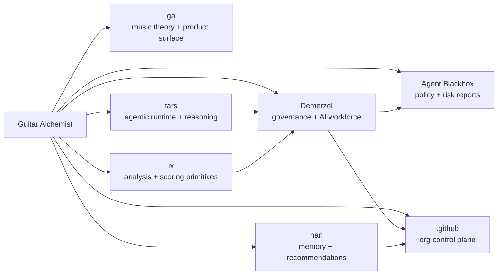

  

# Guitar Alchemist

**Music systems, agentic engineering, and governed AI workspaces.**

Guitar Alchemist is a multi-repository laboratory for building real software with AI agents in the loop. The work started with guitar, music theory, visualization, and creative tools; it has grown into a broader ecosystem for agent-assisted engineering, governance, evaluation, and cross-repo automation.

The core idea is simple:

> AI agents can help build faster, but only if their work is shaped, bounded, reviewed, and made auditable.

This organization is where those ideas are tested against real code, real issues, real pull requests, and real review pressure.

## What lives here

| Area | Repos | Purpose |
|---|---|---|
| Music and product surface | [`ga`](https://github.com/GuitarAlchemist/ga), [`guitaralchemist.github.io`](https://github.com/GuitarAlchemist/guitaralchemist.github.io) | Guitar/music theory tools, visualizations, demos, and product-facing experiments. |
| Governance and AI workforce | [`Demerzel`](https://github.com/GuitarAlchemist/Demerzel), [`agent-blackbox`](https://github.com/GuitarAlchemist/agent-blackbox), [`demerzel-bot`](https://github.com/GuitarAlchemist/demerzel-bot) | Policies, issue routing, review gates, AI-worker coordination, and governance experiments. |
| Research and agent runtime | [`tars`](https://github.com/GuitarAlchemist/tars), [`ix`](https://github.com/GuitarAlchemist/ix), [`hari`](https://github.com/GuitarAlchemist/hari) | Agentic workflows, reasoning tools, scoring, memory, research loops, and cross-repo analysis. |
| Organization control plane | [`.github`](https://github.com/GuitarAlchemist/.github) | Organization profile, roadmap rollups, issue metadata standards, and cross-repo coordination. |

## Current focus

### 1. Guitar Alchemist product work

The original product direction remains active: music theory, fretboard intelligence, guitar visualization, chord/scale exploration, and richer creative interfaces for musicians.

The product stack is evolving around modern web graphics and AI-assisted music workflows, with experiments in WebGPU, real-time visualization, and structured theory datasets.

### 2. AI Workforce / Demerzel

Demerzel is the governance and coordination layer for agentic engineering work. It explores how GitHub issues, labels, PRs, checks, and artifacts can become a practical control plane for multiple AI workers.

Current themes include:

- issue shaping before delegation;
- Jules / Claude / Codex / local-model routing;
- AFK-agent readiness gates;
- budget-aware delegation;
- prompt and harness engineering;
- review backpressure;
- auditability and stop conditions.

The goal is not an all-powerful autonomous agent. The goal is a governed workforce where each agent does bounded work and returns evidence.

### 3. Agent Blackbox

Agent Blackbox is the enforcement and audit side of the ecosystem: policy verdicts, risk reports, harness readiness, and review gates for agent-generated changes.

It is being dogfooded across the organization as part of the broader question:

> What evidence should an AI-generated pull request provide before a human reviewer spends attention on it?

### 4. TARS, IX, and Hari

These repos support the research layer:

- **TARS** explores agentic workflows, grammars, runtime concepts, and cross-model reasoning.
- **IX** holds lower-level analysis, scoring, and algorithmic primitives.
- **Hari** is the memory/recommendation surface for high-uncertainty decisions and cross-repo context.

Together they provide a sandbox for turning research ideas into practical engineering workflows.

## Operating principles

- **GitHub is the control plane.** Issues, labels, PRs, checks, artifacts, and comments are the shared operational record.
- **Agents do bounded work.** A good agent task has scope, non-goals, allowed paths, test commands, evidence requirements, and stop conditions.
- **Governance is separate from execution.** Providers can propose changes; Demerzel and human review decide what advances.
- **Evidence beats confidence.** A useful AI-worker output includes diffs, tests, logs, risk notes, and links back to the originating issue.
- **Small batches win.** Backpressure matters. Do not fan out more agent work than can be reviewed.
- **Local-first where practical.** Use local models, deterministic checks, and cheap analysis before paid/cloud escalation.

## Active coordination

The organization-level rollup lives in:

- [`GuitarAlchemist/.github#9`](https://github.com/GuitarAlchemist/.github/issues/9) — AIW / Jules / AFK coordination rollup

The main AI Workforce roadmap lives in:

- [`GuitarAlchemist/Demerzel#473`](https://github.com/GuitarAlchemist/Demerzel/issues/473) — AI Workforce roadmap and issue hierarchy
- [`GuitarAlchemist/Demerzel#475`](https://github.com/GuitarAlchemist/Demerzel/issues/475) — cross-repo issue triage router

## Live surfaces

- [Public demo site](https://guitaralchemist.github.io/ga/)
- [Component demos](https://demos.guitaralchemist.com/test)
- [Ecosystem roadmap](https://guitaralchemist.github.io/demos/roadmap/)
- [Organization discussions](https://github.com/orgs/GuitarAlchemist/discussions)

## Ecosystem map

## Origin

Guitar Alchemist began as a music-theory engine for guitarists and grew into a governed AI-engineering workspace. The music product remains the creative center. The governance layer exists because real AI-assisted development needs more than prompts: it needs contracts, evidence, review, and memory.

## Contact

For collaboration, pilots, or discussion, open a GitHub Discussion or contact [spareilleux@gmail.com](mailto:spareilleux@gmail.com).

Built as a working lab: music tools, AI agents, governance, evaluation, and cross-repo automation under one roof.
