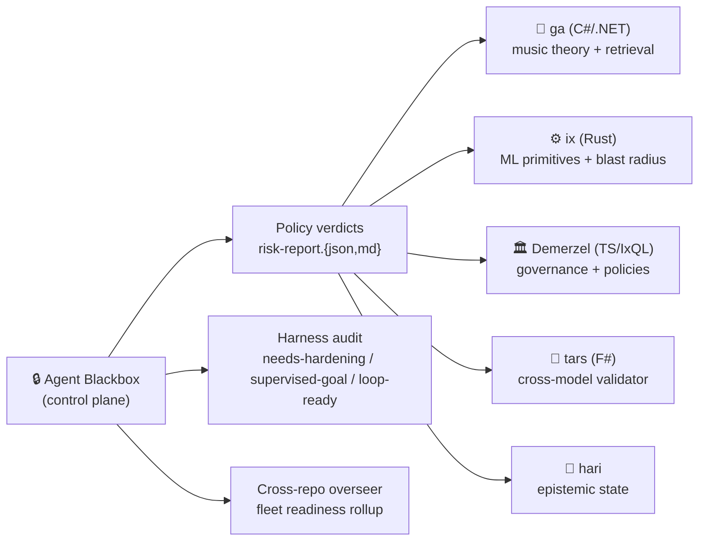

  

# Guitar Alchemist

**Control plane for AI-agent code changes.**

We build **Agent Blackbox** — the policy authority, enforcement gate, and audit trail for the pull requests your autonomous coding agents are already opening. It is the layer above code review, not another code-review tool. It decides whether an agent-emitted change is *allowed* to reach human reviewers, records the policy version that admitted it, and writes the audit record your org will need months later when something has to be reconstructed.

## What Agent Blackbox does

- **Per-PR policy verdict + audit record.** A pass / warn / fail gate on every agent-opened PR, derived from declared repo policy, agent trace, diff, tests, and an Ising-inspired coherence model. Each verdict emits a tamper-evident `risk-report.md` with SHA-256 evidence hashes — the audit trail you'll need six months from now.
- **Harness readiness audit.** `harness-audit` scores whether a repository is `needs-hardening`, `supervised-goal`, or `loop-ready` for autonomous agent work. Cross-repo `overseer` rollup returns a single readiness signal per fleet.
- **Supervised-loop kit.** Bounded autonomous cycles — one cycle, one evidence file, one stop. Designed to be turned on only when the harness audit says the repo can host it safely.

## Who it's for

10–50 person engineering teams running **autonomous CLI agents** — Claude Code (headless), Codex CLI, Aider, OpenHands — against shared repositories, where human code review is no longer the rate-limiting governance step.

The pain is sharpest *post-incident*: an agent that silently disabled a safety check, committed a `.env` with a live key, opened 200 PRs from a prompt regression, or merged a migration that triggered a rollback. The buyer is typically an Eng Lead, Platform / DevEx Lead, or a CISO-adjacent role that owns "what is allowed to land on main".

Agent Blackbox is **not** a fit for autocomplete-only shops (Copilot inline), dashboard-only buyers (refuse enforcement), or teams shopping for a cheaper code-review tool. Those frames contaminate the control-plane unit of value.

## Try it / Pilot

Agent Blackbox is in **private beta** (`v0.1.0-beta.1`). It installs as a pinned GitHub Actions workflow plus a repo policy file. The `install-doctor` preflight surfaces every known install failure mode (PYTHONPATH, missing PAT, Python version) before the first invocation, with a concrete fix next to every `[FAIL]` line. Target install time is under 15 minutes against a real repo with an active coding agent.

- **Request a pilot slot** → email [spareilleux@gmail.com](mailto:spareilleux@gmail.com?subject=Agent%20Blackbox%20pilot%20request) with your team size, the autonomous agent you're running, and a one-line incident context. Pilot slots are scarce and prioritized for teams with fresh agent-caused incidents and real autonomous (T3/T4) workflows.
- **Public site** → [guitaralchemist.github.io/ga](https://guitaralchemist.github.io/ga/)

## How it was built — dogfood surface

Agent Blackbox is built and continuously dogfooded against five sibling open repos. They are the evidence base that proves the control plane works at fleet scale, not the product:

| Repo | Language | Role in the fleet |
|---|---|---|
| [ga](https://github.com/GuitarAlchemist/ga) | C# / .NET 10 | Music-theory domain — large surface, real users, long-running chatbot + retrieval workflows. Quality oracle for retrieval regressions. |
| [ix](https://github.com/GuitarAlchemist/ix) | Rust | ML primitives, code metrics, blast-radius analysis, quality-trend signals. Supplies analysis primitives to Agent Blackbox reports. |
| [Demerzel](https://github.com/GuitarAlchemist/Demerzel) | TS / IxQL | Governance, policies, personas, behavioral tests. Source of the constitutional + tetravalent-logic patterns the control plane enforces. |
| [tars](https://github.com/GuitarAlchemist/tars) | F# | Cross-model theory validator, weighted grammars, MCP tooling. Independent reasoning surface for governance verdicts. |
| [hari](https://github.com/GuitarAlchemist/hari) | — | Epistemic state and cross-repo memory. |

Every meaningful change to any of these repos runs through Agent Blackbox on its way to main. The dogfood `risk-report.md` archive is the artifact that closes the loop.

<b>Show ecosystem diagram</b>

## Live demos

- [**Prime Radiant**](https://demos.guitaralchemist.com/test/prime-radiant) — 3D governance visualization (Demerzel + Seldon analytics).
- [**Component demos**](https://demos.guitaralchemist.com/test) — Fretboard, music theory tools, nature simulations.
- [**Ecosystem roadmap**](https://guitaralchemist.github.io/demos/roadmap/) — interactive Poincaré disk; zoom, pan, click through.

## Community

- [Discussions](https://github.com/orgs/GuitarAlchemist/discussions) — pilot requests, governance reports, Q&A
- [Project board](https://github.com/orgs/GuitarAlchemist/projects/2) — ecosystem roadmap

## Origins

Guitar Alchemist began as a music-theory engine for guitarists ([ga](https://github.com/GuitarAlchemist/ga)) and grew into a multi-repo workspace where AI agents do real work on real domain code. Agent Blackbox is what we built to govern that work — and what we now ship to other teams running autonomous coding agents.

## Acknowledgements

- [Isaac Asimov](https://en.wikipedia.org/wiki/Isaac_Asimov) — Foundation, Laws of Robotics, R. Daneel Olivaw
- [Anthropic](https://www.anthropic.com/) / [Claude Code](https://claude.com/claude-code) — the agent harness this all dogfoods against

Fleet stats: 5 public sibling repos · 6 languages · 200+ MCP tools across the dogfood surface · grammars, policies, and personas live in [Demerzel](https://github.com/GuitarAlchemist/Demerzel).
